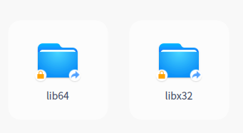

### 任务描述

角标，在文管视图中标在某一文件/文件夹的四个角边的小图标。在文管视图中，单个文件/文件夹可以加入的角标有左上角、左下角、右上角和右下角。而设置单个文件/文件夹角标的方式主要有三种：

1. 系统设定角标，比如单个文件/文件夹具备只读权限，文管则加上“锁”的图标。如果是链接文件，文管则加上“链接图标”，如下图，系统角标不需要三方设置，由文管内部流程决定；

   

2. 文管扩展插件角标设定，由文管插件机制提供一个扩展库 libdfm-extension.so 来提供接口，这是一个纯 C/C++ 接口的库。第三方开发者通过加载该扩展库，按照文管提供的标准来调用和实现相应接口，共同完成定制需求的功能扩展。虽然提供角标的适配接口，但需要开发者具备扩展插件的开发基础，对于一般的用户而言有一定的技术门槛；

3. 通过`gio` 命令进行设置，`gio` 自定义角标支持`svg`、`jpg`、`png`等多种图片格式角标，通过`gio` 设置的角标，可以被文管识别到并进行渲染；在终端输入命：gio set xxx(文件路径) -t stringv metadata::emblems "xxx(图标路径)" ，该命令默认在文件（夹）右下角添加角标。

3. dtkio 也提供 DFile::setAttribute 设置用户自定义属性来兼容角标设置，比如DFile::setAttribute（metadata::emblems, "xxx(图标路径);ld" , stringv , flag）。

基于 `dtkio` 接口，完成一个带 GUI 的角标添加和移除工具，此应用程序应当满足：

1. 项目使用 `cmake` 管理，GUI 基于 `dtkgui` 

2. 界面需求：

   具备文件路径载入操作，文件夹或文件名展示选中操作，角标视图展示及操作区域，下面是具体细节要求；

   - 具备输入文件夹或文件路径的 line-editor，也可以通过某button直接通过filedialog获取文件夹或文件路径；
   - 如果是文件夹，以树形方式展开进行展开，当前文件夹名作为根节点，子文件或文件夹作为子节点依次展开；如果是文件，文件名直接作为根节点；
   - 如果多个文件以树形节点展开，应具备根据文件名搜索选中功能；
   - 当选中某文件夹或文件时，在视图中对当前文件角标情况进行展示；
   - 在视图中可以选中文件4个角进行用户自定义角标设置（系统角标不能修改）；

3. 功能需求：
   - 载入文件夹或文件，并以文件名的形式做展示；
   - 具备通过文件名搜索并选中文件的功能；
   - 选中文件能独立进行角标设置情况展示；
   - 可以进行非系统性角标设置；
   - 可以删除非系统性角标设置；

### 环境的准备

下载并安装最新 `deepin` 操作系统；

- 检查`gio`是否安装正确，直接终端输入 `gio`，是否出现`gio`帮助文档；

- 安装`QtCreator`:  sudo apt install qtcreator

- 安装`dtkio`、`dtkcore`，通过`dtkio`获取文件角标设置。由于 `dtkio` 尚未发布，故在 `deepin` 上还未集成，请自行编译打包安装 `dtkcore` 、`dtkio`。为方便起见，下述步骤假定您在使用 `deepin V20` ，并有管理员权限。

  ```bash
  # 安装最新的 dtkcore
  git clone https://github.com/linuxdeepin/dtkcore.git
  cd dtkcore
  sudo apt build-dep . # 安装编译依赖
  dpkg-buildpackage -us -uc -b # 本地打包
  sudo dpkg -i ../libdtkcore*  # 也可以手动选择不安装 dbgsym 和 doc 包
  
  # 安装最新的 dtkio
  git clone https://github.com/linuxdeepin/dtkio.git
  cd dtkio
  sudo apt build-dep . # 安装编译依赖
  dpkg-buildpackage -us -uc -b # 本地打包
  sudo dpkg -i ../libdtkmount*  # 也可以手动选择不安装 dbgsym 和 doc 包
  
  ```


### 验收标准

最终完成的应用程序应当能够提供下述功能：

- [ ] 能够恰当的运行和退出
- [ ] 代码符合 deepin 编码风格
- [ ] 文件属性获取和设置基于`dtkio`完成，兼容并提供`gio`命名模式设置，提供关键操作日志打印
- [ ] 项目用 CMake 管理，GUI 程序基于 DTK
- [ ] 界面操作满足功能需求
- [ ] 界面美观大方，易用
- [ ] 界面主题可随系统设置而改变

我们通过对上述各项标准的完成数量来评估任务的完成程度

### 涉及的项目/提交到何处

- 此项目需要您最终将代码提交到 `linuxdeepin/dtkio` 仓库之中
- 在仓库中的 `dtkio/dtkio/examples` 目录下存储您的代码

### 预计工作量 116h

- 创建环境8h
- 熟悉需求4h
- 熟悉dtkio及gio相关资料 8h
- 设计10h
- 代码编写 60 h
- 自测 16h
- 验收及沟通 10h


### 参考文档

- [dtkio 开发文档](https://github.com/linuxdeepin/dtkio/tree/master/dtkio/docs)
- [deepin 编码风格](https://github.com/linuxdeepin/deepin-styleguide)
- [统信UOS 文件角标设置](http://m.8fe.com/jiaocheng/5936.html)

### 联系方式

此任务的任务对接人为： lvwujun@uniontech.com

