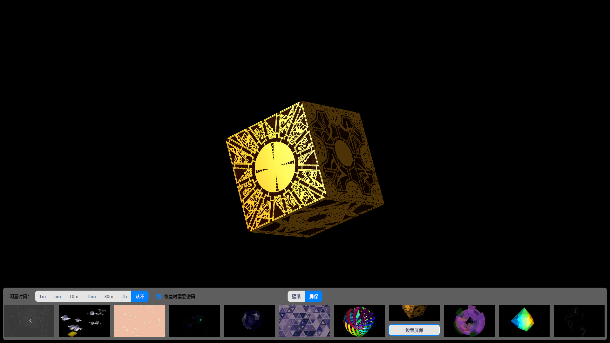
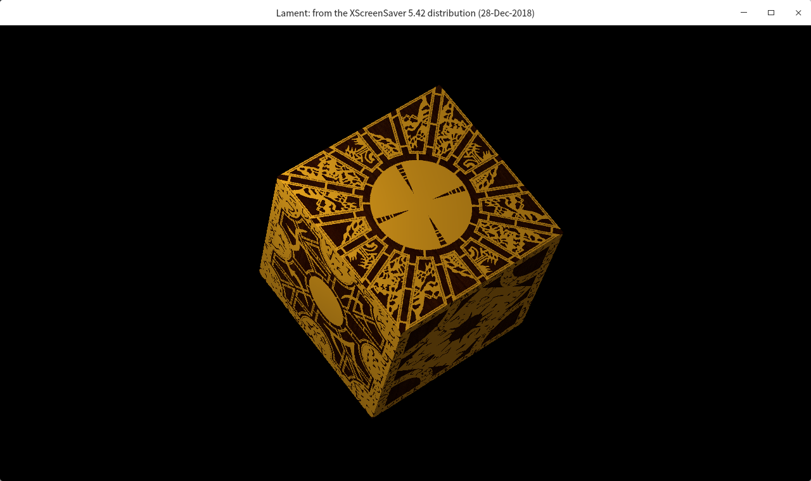

### 任务描述

`Deepin`系统中自带了多种实时渲染的屏幕保护程序。在桌面右键菜单中`壁纸与屏保`选项进入设置界面，然后点击`屏保`按钮即可预览和设置屏保。



上图中每个屏保都是独立的可执行程序，其存放在`/usr/lib/deepin-screensaver/modules/`。它们都被屏保服务`deepin-screensaver`统一管理，新开发的屏保程序只需安装到该路径下即可被屏保服务加载。

其中每个屏保的名称就是可执行程序名，如`lament`。在`modeles`下直接运行:

```bash
cd /usr/lib/deepin-screensaver/modules/
./lament
```

会出现一个窗口化的屏保程序。



若使用屏保服务启动，则以全屏的形式运行，系统进入显示屏保的状态。

```bash
deeepin-screensaver lament
```

另外`/usr/lib/deepin-screensaver/modules/cover`还存放了屏保的缩略图，格式为`屏保名称.jpg`，如`lament`的缩略图为`lament.png`，而带`@2x`和`@3x`后缀的为尺寸更大的缩略图。

`deeepin-screensaver`在启动时会首先创建屏保窗口，然后启动屏保应用，并将窗口ID（如12345678）传给屏保应用。如在启动`lament`，执行的命令为

```bash
lament -window-id 12345678
```

屏保应用通过启动参数获取到窗口ID后需要将该窗口ID设置为自己的窗口的父窗口，使得绘制的屏保画面能显示在正确的位置。

基于`deepin-screensaver`服务框架，完成一个能播放视频的屏保程序和发布工具。

视频屏保程序应该满足：

1. 项目使用`Qt`管理，使用`Qt`开发套件。

2. 屏保程序至少可播放`mp4`、`avi`、`mov`格式的视频文件。

3. 屏保程序根据可执行程序的名称（exe），加载对应文件夹下的视频资源（/usr/share/$exe/resource/）。

   如：屏保程序的可执行名称为`demo`时，其需加载的资源目录为`/usr/share/demo/resource/`。

   若将其文件名为`test`后，其加载的资源目录变为`/usr/share/test/resource/`。

4. 屏保启动后以静音模式轮播资源目录下的视频文件。

5. 屏保支持直接运行，启动后以窗口化的形式播放视频。

6. 屏保支持指定父窗口，即以传参`-window-id`的形式，启动后视频在传入的窗口上播放。

7. 屏保以指定父窗口的模式运行时，视频播放界面的大小位置需与父窗口一致。

8. 屏保程序安装后，可在桌面的屏保设置窗口显示并预览。

9. 在屏保设置窗口可设置该屏保程序为当前屏保，并在静置后启动该屏保，播放视频。

发布工具应该满足：

1. 项目使用`Qt`管理，使用`Qt`与`DTK`开发套件。
2. 工具内置视频屏保程序，作为模板。
3. 工具界面应使用`DTK`控件，包含以下功能：

   - 工具以向导的形式依次执行以下步骤。
   - 输入屏保名称，仅支持文件名可用的英文和字符。
   - 导入本地视频文件，需校验视频格式是否支持。
   - 导入缩略图，需校验图片格式。
   - 打包发布。
   - 跟随系统主题切换深色/浅色模式。
   
4. 工具点击发布后自动按`Debian`包规范生成资源文件，并自动打包为`deb`安装包。
5. 安装包包含以下资源：
   - 文件名为`输入的屏保名称`的视频屏保程序。
   - 文件名为`输入的屏保名称.jpg`等符合规范的缩略图。
   - 导入的视频文件。
6. 安装包安装资源：
   - 可执行程序安装到`/usr/lib/deepin-screensaver/modules/`
   
   - 缩略图安装到`/usr/lib/deepin-screensaver/modules/cover/`
   
   - 视频文件安装到`/usr/share/$可执行程序名/resource/`
7. 发布工具不限使用次数，可发布多个视频屏保。
8. 发布的安装包程序安装后可正常使用。

### 环境的准备

下载并安装最新 `deepin` 操作系统；

- 安装`QtCreator`:  sudo apt install qtcreator
- 安装`gdb`：sudo apt install gdb
- 派生屏保仓库：https://github.com/linuxdeepin/deepin-screensaver
- 安装屏保依赖库: sudo apt build-dep deepin-screensaver
- 本地克隆仓库：git clone %你的派生仓库地址%

### 验收标准

最终完成的应用程序应当能够提供下述功能：
- [ ] 项目用 Qt 管理，基于Qt开发
- [ ] 视频屏保程序满足功能要求
- [ ] 发布工具满足功能要求
- [ ] 发布的安装包符合`Debian`包规范，可正常使用
- [ ] 视频播放流畅，无较高的硬件资源占用
- [ ] 程序无内存泄漏、卡死、崩溃
- [ ] 能够正确的启动和退出
- [ ] 代码符合 deepin 编码风格

我们通过对上述各项标准的完成数量来评估任务的完成程度。

### 涉及的项目/提交到何处

- 此项目需要您最终将代码提交到 `linuxdeepin/deepin-screensaver` 仓库之中

- 在仓库中的 `customscreensaver` 目录存储您的代码

### 预计工作量

此任务预计总耗时134小时。

- 创建环境4小时
- 熟悉需求6小时
- 熟悉屏保及包构建相关资料 8小时
- 设计12小时
- 代码编写  80小时
- 自测 16小时
- 验收及沟通 8小时

### 参考文档

- [构建软件包](https://www.debian.org/doc/manuals/maint-guide/build.zh-cn.html)
- [参考屏保代码](https://github.com/linuxdeepin/deepin-screensaver/tree/master/customscreensaver/deepin-custom-screensaver)
- [deepin 编码风格](https://github.com/linuxdeepin/deepin-styleguide)

### 联系方式

此任务的任务对接人为： zhangyub@uniontech.com
