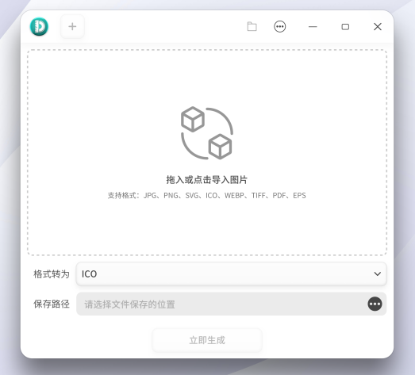

### 任务描述

`DCI` 图标是一种整合性图标格式，应用可以使用该图标完成多种状态的自动变化。例如， `ListView` 控件中高亮的 `Item` 图标自动反白，`Menu` 中图标跟随当前 `Item` 变化等等。

基于 `dtkgui` 和 `dtkdeclarative`  完成一个可以转换 `DCI` 格式图标的小工具

此应用程序应当满足：
 - 项目用` CMake` 管理，`Gui` 程序基于 `DTK`
 - 界面需求
    - 界面使用 `QML` 开发，使用 dtkdeclarative 特性（如`ColorSelector`、`DCI 图标`、`DConfig` 等）
    - 初始界面有文案提示用户支持点击和拖拽图片目录等方式（支持图片格式 png，jpg，webp，svg）
    - 支持选择保存文件路径（默认保存位置 ~/Pictures），可以修改（需要记住，可以参考使用 DConfig ）
    - 支持一键打开保存目录
    - 支持将目录直接拖拽到界面，并解析出对应资源，显示出来
    - 以下主界面供参考，版本信息等可以在关于对话框中显示。

     
- 功能需求
    - 支持 `DCI` 图标生成，可以手动选择不同状态的图片资源，并调整图层，填充间隔，调色板，色度，饱和度，亮度等信息（注意：至少需要有 `normal.light` 详情参考 [DCI 图标介绍](./DCI%E5%9B%BE%E6%A0%87%E4%BB%8B%E7%BB%8D.md)）
    - 支持 `DCI` 图标预览，图片资源导出，或者全部导出
    - 支持批量生成多个 `DCI` 图标（如拖入多个目录生成多个和目录同名的 `DCI` 图标）
 


### 环境的准备

由于 `DCI` 图标是开发特性，故在 `deepin` 上还未集成，请自行编译打包安装 `dtkcore` / `dtkgui` / `dtkdeclarative` 。为方便起见，下述步骤假定您在使用 `deepin V20` ，并有管理员权限。
 
 ```bash
git clone https://github.com/linuxdeepin/dtkcore.git
cd dtkcore
sudo apt build-dep . # 安装编译依赖
dpkg-buildpackage -us -uc -b # 本地打包
sudo dpkg -i ../libdtkcore*  # 也可以手动选择不安装 dbgsym 和 doc 包
git clone https://github.com/linuxdeepin/dtkgui.git
cd dtkgui
sudo apt build-dep .
dpkg-buildpackage -us -uc -b
sudo dpkg -i ../libdtkgui* # 也可以选择之安装 dev 包和 so 包
# dtk qml 行云风格应用支持
git clone https://github.com/linuxdeepin/dtkdeclarative.git
cd dtkdeclarative
sudo apt build-dep .
dpkg-buildpackage -us -uc -b
sudo dpkg -i ../qml-module-*  ../libdtkdeclarative*
 ```
经过上述步骤 `DCI` 图标相关依赖安装完成，可以开发小工具了。

### 验收标准

 最终完成的应用程序应当能够提供下述功能：

   - [ ] 能够恰当的运行和退出
   - [ ] 项目用 CMake 管理，Gui 程序基于 DTK
   - [ ] 使用 qml 开发界面，用到 dtkdeclarative 相关特性
   - [ ] 能够通过不复杂的操作（如添加图片或者目录）生成 DCI 图标文件
   - [ ] 项目支持打包成 deb（debian目录）
   - [ ] 项目应该符合开源代码合规准则
   - [ ] 支持 DCI 图标预览与导出图片
   - [ ] 支持拖拽和手动添加图片或者目录等资源
   - [ ] 能够编辑 DCI 图标文件，修改图片资源

    我们通过对上述各项标准的完成数量来评估任务的完成程度

### 涉及的项目/提交到何处
- 对于 `dci-tool` 的开发，可以直接在您自己的帐号下新建仓库进行开发。
- 此项目需要您最终将代码提交 `pull request` 到 `linuxdeepin/dci-tool` 之中


### 参考文档

 - [DCI 图标介绍](./DCI%E5%9B%BE%E6%A0%87%E4%BB%8B%E7%BB%8D.md)
 - [DCI 文件命令行小工具实现](https://github.com/linuxdeepin/dtkcore/blob/master/tools/dci)
 - [DCI 文件格式的实现](https://github.com/linuxdeepin/dtkcore/tree/master/src/dci)
 - [DCI 图标的实现](https://github.com/linuxdeepin/dtkgui/blob/master/src/util/ddciicon.cpp)
 - [DTK项目模板参考](https://github.com/linuxdeepin/dtk-template)
 - [dtk qml 开发指南](dtkdeclarative%E5%BC%80%E5%8F%91%E6%8C%87%E5%8D%97.md)
 - [开源代码合规准则](https://wiki.deepin.org/开源代码合规准则)


### 联系方式
[开发者邮件列表](https://www.freelists.org/list/deepin-devel)
